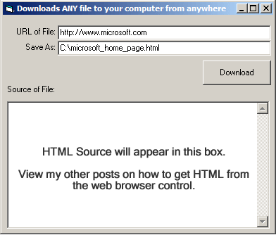



## URLDownloadToFile Download a URL using the Windows API to DOWNLOAD The File \- Downloading a URL

### Description

to download a file to your computer from the internet, or anywhere else. You could even use this to copy files on your computer, or on a network. it works in anyway you can think of, even FTP. Give it a try ;)
 
### More Info
 
A downloaded File to your machine, specified by you.

This will not execute files, it will download and store. 100% Safe. Scripts will not run during download, and images should not download to cache either. It's strictly SOURCE download.

             |
---                |---
**Submitted On**   |2005-10-20 18:05:28
**By**             |[Nathan A\. Huebner](https://github.com/Planet-Source-Code/PSCIndex/blob/master/ByAuthor/nathan-a-huebner.md)
**Level**          |Advanced
**User Rating**    |5.0 (20 globes from 4 users)
**Compatibility**  |VB 6\.0
**Category**       |[Internet/ HTML](https://github.com/Planet-Source-Code/PSCIndex/blob/master/ByCategory/internet-html__1-34.md)
**World**          |[Visual Basic](https://github.com/Planet-Source-Code/PSCIndex/blob/master/ByWorld/visual-basic.md)
**Archive File**   |[URLDownloa19420210202005\.zip](https://github.com/Planet-Source-Code/nathan-a-huebner-urldownloadtofile-download-a-url-using-the-windows-api-to-download-the-fi__1-62965/archive/master.zip)

